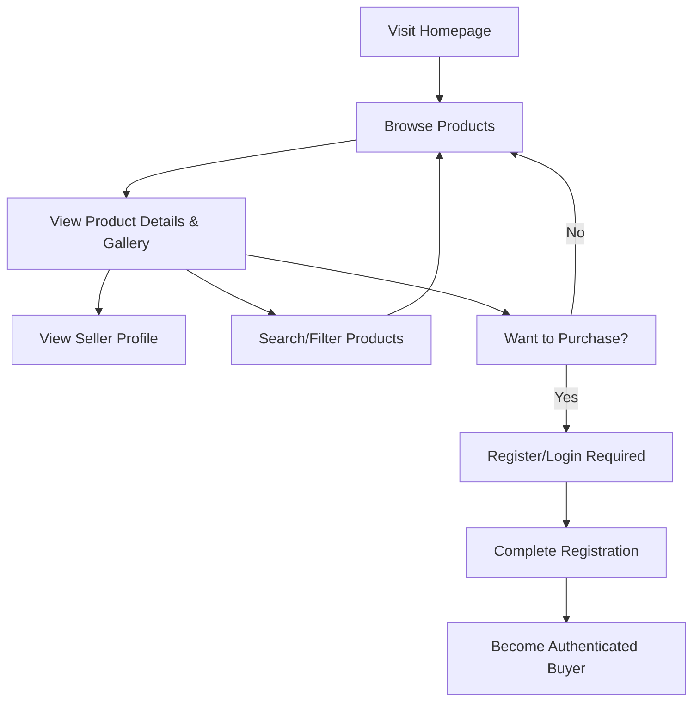
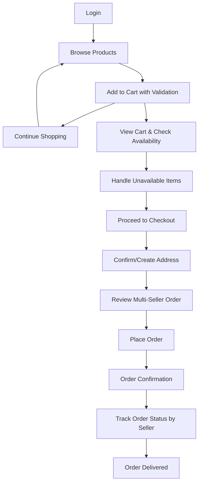
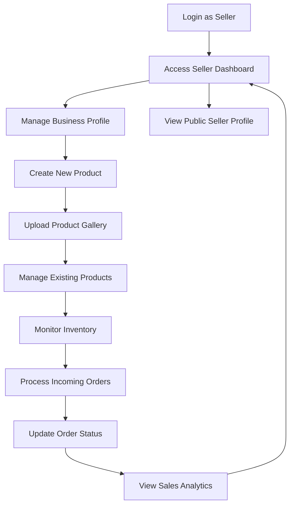
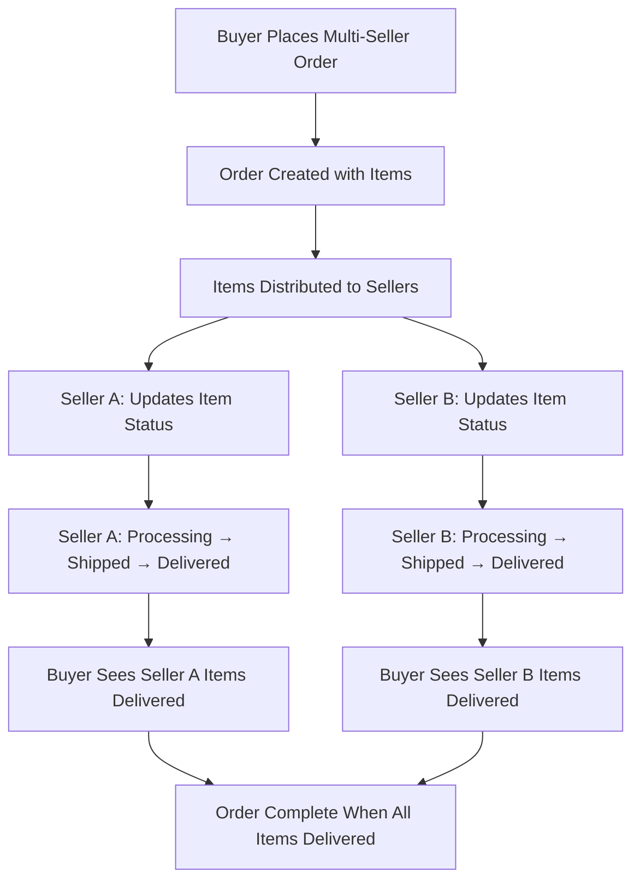

# Functional Specifications and User Flows

## 1. Introduction

This document provides detailed functional specifications for the Full-Stack E-Commerce Marketplace MVP, defining what the system does and how users interact with it. Each function is described with its inputs, outputs, validation rules, and expected behaviors, including multi-seller marketplace capabilities.

## 2. Core System Functions

### 2.1 Authentication Functions

#### User Registration
**Purpose:** Create new user accounts with email and password authentication.

**Inputs:**
- Email address (required, unique)
- Password (required, minimum 8 characters)
- First name (required)
- Last name (required)
- Phone number (optional)

**Process:**
1. Validate email format and uniqueness
2. Validate password strength requirements
3. Create user record with buyer role by default
4. Auto-verify email (no verification workflow for MVP)
5. Generate JWT token with user claims
6. Set HttpOnly cookie for session management

**Outputs:**
- Success: User profile data and authentication token
- Error: Validation errors or system errors

**Business Rules:**
- Email must be unique across the system
- Password must meet minimum security requirements
- New users are assigned buyer role by default
- Users can upgrade to seller status later

#### User Login
**Purpose:** Authenticate existing users and establish session.

**Inputs:**
- Email address
- Password

**Process:**
1. Validate email and password against database
2. Generate JWT token with user role claims
3. Set secure HttpOnly cookie
4. Return user profile and authentication status

**Outputs:**
- Success: User profile data and session establishment
- Error: Invalid credentials or account issues

#### User Logout
**Purpose:** Terminate user session securely.

**Process:**
1. Clear authentication cookies
2. Invalidate session on frontend
3. Redirect to home page

#### Profile Management
**Purpose:** Allow users to view and update their profile information.

**Functions:**
- View profile information
- Edit personal details (name, email, phone)
- Change password with current password verification
- Enable/disable seller status
- Manage seller business profile (for sellers)

### 2.2 Product Functions

#### Product Creation (Sellers Only)
**Purpose:** Allow sellers to create new product listings with comprehensive information.

**Inputs:**
- Product name (required, 5-200 characters)
- Description (required, 10-2000 characters)
- Price (required, positive decimal, max 2 decimal places)
- Category selection from predefined enum (Electronics, Clothing, Books, Home, Sports)
- Image URLs array (required, at least 1, max 5 URLs)
- Stock quantity (required, non-negative integer, max 9999)
- Product status (active/inactive, default active)

**Process:**
1. Validate all input fields according to business rules
2. Verify user has seller role and active status
3. Validate image URLs are accessible and valid format
4. Create product record with seller assignment
5. Set initial stock levels and availability status

**Outputs:**
- Success: Product created with unique product ID
- Error: Validation errors or permission denied

**Business Rules:**
- Only authenticated sellers can create products
- Products are assigned to the creating seller automatically
- Products start as active by default
- Stock quantity affects availability display
- Image URLs must be valid and accessible

#### Product Browsing (Public Access)
**Purpose:** Allow all users to discover and view products with availability handling.

**Functions:**
- Product listing with pagination (20 products per page)
- Category-based filtering using predefined categories
- Basic text search across product names and descriptions
- Price range filtering (min/max price inputs)
- Sort by price (low to high, high to low) and date added
- Individual product detail view with image gallery
- Product availability status display
- Out-of-stock product handling (visible but disabled)

**Process:**
1. Query active products based on filters and availability
2. Apply pagination for performance optimization
3. Return product data with seller information and availability status
4. Handle empty result sets gracefully
5. Display availability indicators for each product

**Outputs:**
- Product listings with pagination metadata
- Individual product details with image galleries
- Category listings with product counts
- Search results with availability status

**Availability States:**
- **Available:** In stock and can be purchased
- **Out of Stock:** Visible but cannot be added to cart
- **Unavailable:** Seller deactivated or product inactive

#### Product Management (Sellers Only)
**Purpose:** Allow sellers to manage their existing products with inventory control.

**Functions:**
- View list of own products with status indicators
- Edit product information (all fields modifiable)
- Update stock quantities with immediate effect
- Activate/deactivate products
- Delete products (soft delete with order history preservation)
- Monitor basic product performance metrics

**Process:**
1. Verify product ownership by seller
2. Apply updates with comprehensive validation
3. Maintain product history for existing orders
4. Update product availability status
5. Handle cart cleanup for deactivated products

**Business Rules:**
- Sellers can only manage their own products
- Products with pending orders cannot be deleted
- Stock changes immediately affect availability
- Price changes don't affect existing orders
- Deactivated products are removed from active browsing

### 2.3 Shopping Cart Functions

#### Cart Management with Validation
**Purpose:** Manage shopping cart for authenticated buyers with real-time validation.

**Functions:**
- Add product to cart with stock validation
- Remove products from cart
- Update product quantities with availability checking
- View cart contents with seller breakdown
- Clear entire cart
- Validate cart items availability
- Handle unavailable items gracefully

**Inputs:**
- Product ID and quantity for additions
- Product ID for removals
- Product ID and new quantity for updates

**Process:**
1. Validate product availability and current stock levels
2. Check user authentication status
3. Verify seller and product active status
4. Update cart state in both frontend and backend
5. Calculate cart totals with multi-seller breakdown
6. Persist cart across browser sessions (30-day retention)
7. Flag unavailable items for user attention

**Outputs:**
- Updated cart contents with availability status
- Cart totals (subtotal per seller, tax, total)
- Item count and detailed availability information
- Unavailable item warnings

**Cart Validation Rules:**
- Only authenticated users can manage cart
- Cart quantities cannot exceed available stock
- Unavailable products are flagged but not auto-removed
- Cart persists for 30 days for logged-in users
- Real-time validation at cart view and modification

#### Cart Cleanup and Maintenance
**Purpose:** Maintain cart integrity when products become unavailable.

**Functions:**
- Automatic flagging of unavailable items
- User notification of cart changes
- Manual removal of unavailable items
- Cart validation before checkout

**Process:**
1. Regular validation of cart items against product availability
2. Flag items where product is inactive or seller deactivated
3. Notify users of availability changes
4. Provide options to remove or save items for later

### 2.4 Order Functions

#### Multi-Seller Checkout Process
**Purpose:** Convert shopping cart into confirmed orders supporting multiple sellers.

**Process:**
1. Validate all cart contents and stock availability
2. Verify user address information (create if needed)
3. Calculate final order totals including tax breakdown
4. Create single order record with unique order number
5. Create individual order items with seller tracking
6. Update product stock levels for all items
7. Clear shopping cart after successful order
8. Send order confirmation with seller breakdown

**Inputs:**
- Cart contents validation
- Shipping address (from UserAddress or new entry)
- Payment method placeholder (cash on delivery for MVP)

**Outputs:**
- Order confirmation with unique order number
- Order details showing items grouped by seller
- Updated product stock levels
- Individual seller notifications (future enhancement)

**Business Rules:**
- Stock levels are validated again at checkout
- Orders create permanent records with address snapshots
- Stock is decremented upon order placement
- Single order can contain items from multiple sellers
- Orders cannot be modified after placement

#### Order Management for Buyers
**Purpose:** Allow buyers to track and manage their multi-seller orders.

**Functions:**
- View order history with pagination and seller breakdown
- View individual order details showing items by seller
- Track order status progression (item-level tracking)
- View shipping address snapshot for each order
- Monitor delivery status from multiple sellers

**Order Display Structure:**
- Order overview with total and item count
- Items grouped by seller with individual statuses
- Seller information for each item group
- Individual item tracking and status

**Order Status Flow (Item-Level):**
1. **Pending:** Item ordered, awaiting seller confirmation
2. **Processing:** Seller confirmed and preparing item
3. **Shipped:** Item shipped by seller
4. **Delivered:** Item delivered to customer

#### Order Processing for Sellers
**Purpose:** Allow sellers to fulfill customer orders independently.

**Functions:**
- View incoming orders containing their products only
- Update order item status for their products independently
- View customer shipping information for their orders
- Access order management dashboard with filtering
- Process orders through defined status workflow

**Process:**
1. Display orders filtered to show only seller's products
2. Allow status updates with timestamps for their items only
3. Provide customer shipping details for fulfillment
4. Track order completion metrics for seller analytics
5. Enable independent fulfillment workflow

**Business Rules:**
- Sellers can only see orders containing their products
- Sellers can only update status for their items
- Status progression is enforced (cannot skip steps)
- Customer information limited to order-related data
- Independent seller fulfillment supported

### 2.5 Address Management

#### Single Address per User
**Purpose:** Manage shipping address for checkout and order delivery.

**Functions:**
- Create address if none exists (required for first order)
- View current address information
- Edit existing address with validation
- Use address in checkout process with snapshot
- Historical address preservation for orders

**Address Fields:**
- Address line 1 (required, max 255 characters)
- Address line 2 (optional, max 255 characters)
- City (required, max 100 characters)
- State/Province (required, max 100 characters)
- Postal code (required, max 20 characters)
- Country (required, default Thailand)
- Phone number (optional, valid format)

**Business Rules:**
- Each user can have exactly one current address (1-to-1 relationship)
- Address is required for checkout process
- Address updates apply to future orders only
- Historical orders maintain original address snapshots
- Address validation ensures deliverable locations

### 2.6 Seller Profile Management

#### Public Seller Profiles
**Purpose:** Provide public-facing seller information and product showcase.

**Functions:**
- Display seller business name and description
- Show seller join date and activity metrics
- List all active products from the seller with pagination
- Provide basic seller statistics (product count, member since)
- Enable product browsing within seller context

**Information Displayed:**
- Business/display name
- Business description
- Member since date
- Total number of active products
- Product catalog with search and filtering
- Basic seller performance indicators

**Business Rules:**
- Only public, business-appropriate information shown
- Personal contact details are protected
- Only active products are displayed in seller catalog
- Seller ratings/reviews placeholder for future enhancement

#### Seller Dashboard and Business Management
**Purpose:** Provide sellers with comprehensive business management interface.

**Functions:**
- Overview of seller account and business activity
- Product management interface with full CRUD operations
- Order processing tools with status management
- Basic sales metrics and performance indicators
- Business profile settings and information management

**Dashboard Sections:**
- Quick stats (total products, pending orders, recent activity)
- Product management (create, edit, view all products, inventory)
- Order management (process orders, update status, customer info)
- Business profile settings (business name, description, contact info)

### 2.7 System Functions

#### Data Validation and Business Rules
**Purpose:** Ensure data integrity and enforce business logic.

**Frontend Validation:**
- Real-time form validation with immediate feedback
- Input format validation (email, phone, URLs, prices)
- Required field enforcement with clear indicators
- Character limits and data type validation
- Stock quantity validation against availability

**Backend Validation:**
- Server-side validation of all inputs and business rules
- Cross-reference validation (stock levels, seller status)
- Data sanitization and security checks
- Database constraint validation and error handling
- Business logic enforcement (order rules, permissions)

**Validation Rules:**
- Email format and uniqueness across system
- Password strength requirements (minimum 8 characters)
- Positive numbers for prices and quantities
- URL format validation for image links
- Required field completion before submission
- Stock availability before cart operations

#### Error Handling and User Experience
**Purpose:** Provide clear feedback and graceful system degradation.

**Error Types and Handling:**
- Validation errors with specific field feedback
- Network connectivity issues with retry options
- Server errors with user-friendly messages
- Permission denied scenarios with clear explanations
- Resource not found situations with helpful suggestions
- Stock availability conflicts with alternative actions

**Error Response Format:**
```json
{
  "success": false,
  "error": {
    "code": "VALIDATION_ERROR",
    "message": "Please correct the following errors",
    "details": {
      "email": "Email address is required",
      "password": "Password must be at least 8 characters",
      "stock": "Requested quantity exceeds available stock"
    }
  }
}
```

**User Experience Guidelines:**
- Clear, actionable error messages
- Inline validation feedback during form interaction
- Loading states during API calls and operations
- Retry mechanisms for transient errors
- Helpful suggestions for error resolution

#### Security Functions
**Purpose:** Protect user data and system integrity.

**Authentication Security:**
- JWT tokens with appropriate expiration times
- Secure HttpOnly cookies for session management
- Password hashing with bcrypt
- Session management and automatic timeout
- Role-based access control enforcement

**Authorization Controls:**
- Role-based access control (Guest/Buyer/Seller)
- Resource ownership verification for all operations
- API endpoint protection with proper authentication
- Frontend route guards preventing unauthorized access
- Data filtering based on user permissions

**Data Protection:**
- Input sanitization to prevent XSS attacks
- SQL injection prevention through parameterized queries
- Data validation and type checking at all levels
- Secure data transmission (HTTPS enforcement)
- Privacy protection for sensitive user information

#### Performance Functions
**Purpose:** Ensure responsive user experience and system scalability.

**Database Optimization:**
- Pagination for large data sets (products, orders, cart items)
- Indexed queries for search and filtering operations
- Efficient joins for related data retrieval
- Query result caching where appropriate
- Optimized queries for multi-seller operations

**Frontend Performance:**
- Component-level code splitting for faster loading
- Image optimization and lazy loading for galleries
- Efficient state management with minimal re-renders
- Optimized API calls and data fetching strategies
- Caching strategies for frequently accessed data

**Caching Strategy:**
- Static content caching (categories, public seller data)
- API response caching for frequently accessed data
- Browser caching for assets and images
- Database query result caching for performance
- Cart state caching with synchronization

## 3. User Flows

### 3.1 Guest User Flow



**Detailed Steps:**
1. User visits marketplace homepage
2. Browse featured products and categories
3. Use search and filters to find specific products
4. View individual product details with image galleries
5. Explore seller profiles and their product catalogs
6. Decide to purchase - prompted to register/login
7. Complete registration process to become authenticated buyer

### 3.2 Buyer User Flow



**Detailed Steps:**
1. User logs in with email/password
2. Browse products with full cart functionality
3. Add desired products to cart with real-time validation
4. Continue shopping or proceed to cart review
5. Review cart contents, handle any unavailable items
6. Resolve any stock or availability issues
7. Proceed to checkout process
8. Confirm shipping address (create if first time)
9. Review order summary showing items by seller
10. Place order and receive confirmation
11. Track order status with seller-specific updates
12. Monitor delivery progress for each seller

### 3.3 Seller User Flow



**Detailed Steps:**
1. User logs in and accesses seller dashboard
2. Set up or update business profile information
3. Create new product listings with detailed information
4. Upload multiple images for product galleries
5. Manage existing products (edit, update stock, status)
6. Monitor inventory levels and availability
7. View incoming orders for their products
8. Process orders by updating status independently
9. Monitor basic sales metrics and performance
10. View public seller profile as customers see it

### 3.4 Multi-Seller Order Processing Flow



**Multi-Seller Coordination:**
- Single order contains items from multiple sellers
- Each seller manages only their items independently
- Buyer sees unified order with seller-specific tracking
- Order completion when all sellers complete delivery

## 4. API Endpoints Overview

### 4.1 Authentication Endpoints
```
POST /api/auth/register        - User registration
POST /api/auth/login           - User login
POST /api/auth/logout          - User logout
GET  /api/auth/profile         - Get user profile
PUT  /api/auth/profile         - Update user profile
PUT  /api/auth/password        - Change password
```

### 4.2 Product Endpoints
```
GET    /api/products                    - List products (public, with availability)
GET    /api/products/:id                - Get product details (public)
POST   /api/products                    - Create product (sellers)
PUT    /api/products/:id                - Update product (sellers)
DELETE /api/products/:id                - Delete product (sellers)
GET    /api/products/seller/:id         - Get seller's products (public)
GET    /api/products/availability/:id   - Check product availability
```

### 4.3 Cart Endpoints with Validation
```
GET    /api/cart                        - Get cart contents with validation
POST   /api/cart/items                  - Add item to cart (with stock check)
PUT    /api/cart/items/:id              - Update cart item quantity
DELETE /api/cart/items/:id              - Remove item from cart
DELETE /api/cart                        - Clear cart
POST   /api/cart/validate               - Validate entire cart
GET    /api/cart/availability           - Check cart items availability
```

### 4.4 Order Endpoints
```
POST   /api/orders                      - Create order (multi-seller checkout)
GET    /api/orders                      - Get user's orders
GET    /api/orders/:id                  - Get order details
PUT    /api/orders/:id/items/:itemId/status - Update order item status (sellers)
GET    /api/orders/seller               - Get seller's order items
GET    /api/orders/:id/items/seller     - Get seller's items in specific order
```

### 4.5 User Address Endpoints
```
GET    /api/users/address               - Get user address
POST   /api/users/address               - Create user address
PUT    /api/users/address               - Update user address
```

### 4.6 Seller Profile Endpoints
```
GET    /api/sellers/:id                 - Get public seller profile
GET    /api/sellers/:id/products        - Get seller's products
PUT    /api/sellers/profile             - Update seller business profile
GET    /api/sellers/dashboard           - Get seller dashboard data
POST   /api/sellers/profile             - Create seller business profile
```

## 5. Business Rules Summary

### 5.1 User Management
- New users are buyers by default
- Users can upgrade to seller status
- Single address per user (1-to-1 relationship)
- Auto-verify emails for MVP simplicity

### 5.2 Product Management
- Sellers can only manage their own products
- Products use predefined category enum values
- Stock levels affect purchase availability
- Out-of-stock products remain visible but disabled
- Inactive products are hidden from public browsing

### 5.3 Multi-Seller Order Processing
- Single order can contain items from multiple sellers
- Orders create permanent records with address snapshots
- Stock is decremented upon order placement
- Item-level status tracking for independent seller fulfillment
- Sellers see only orders containing their products

### 5.4 Cart and Checkout Validation
- Cart requires user authentication
- Real-time stock validation at cart operations
- Cart items flagged when products become unavailable
- 30-day cart persistence for logged-in users
- Address required for all order placements

### 5.5 Security and Privacy
- Role-based access control throughout system
- Users can only access their own data
- Sellers access limited to their products and related orders
- Public seller profiles contain only business information
- Order information shared only between relevant parties

---

**Note:** This functional specification defines the complete MVP scope with multi-seller marketplace capabilities while maintaining simplicity and focus on core e-commerce functionality. Each function is designed to work independently while integrating seamlessly with other system components to provide a comprehensive marketplace experience.
