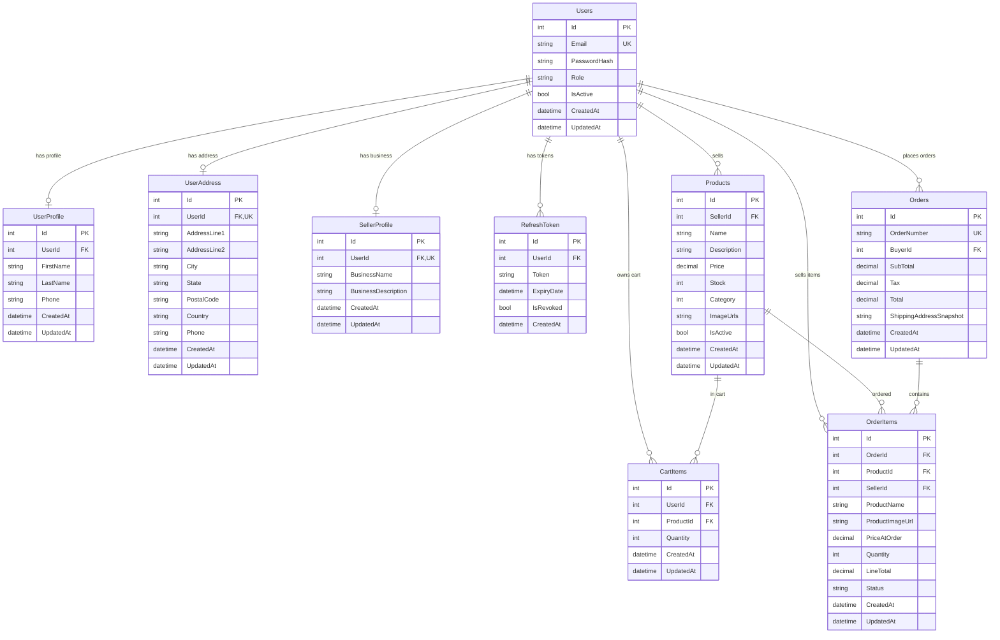

# Data Models and Database Schema

## 1. Introduction

This document defines the complete database schema and data models for the Full-Stack E-Commerce Marketplace MVP. The design supports a multi-seller marketplace with comprehensive product management, cart functionality, and order processing while maintaining simplicity and performance.

## 2. Database Architecture Overview

### 2.1 Technology Stack
- **Database:** SQLite with Entity Framework Core
- **ORM:** Entity Framework Core with Code-First approach
- **Migration Strategy:** Incremental migrations from existing user schema
- **Performance:** Indexed queries optimized for multi-seller operations

### 2.2 Design Principles
- **Multi-Seller Support:** Independent seller operations with data isolation
- **Data Integrity:** Comprehensive constraints and foreign key relationships
- **Performance Optimization:** Strategic indexing for common query patterns
- **Scalability:** Schema designed for future enhancements without breaking changes

## 3. Existing Entities (Leverage Current Schema)

### 3.1 Users Table (Already Implemented)
```sql
Users {
  Id: int IDENTITY(1,1) PRIMARY KEY
  Email: nvarchar(256) NOT NULL UNIQUE
  PasswordHash: nvarchar(max) NOT NULL
  Role: nvarchar(50) NOT NULL DEFAULT 'Buyer'  -- 'Buyer', 'Seller'
  IsActive: bit NOT NULL DEFAULT 1
  CreatedAt: datetime2 NOT NULL DEFAULT GETUTCDATE()
  UpdatedAt: datetime2 NOT NULL DEFAULT GETUTCDATE()
}
```

**Usage in E-commerce:**
- Role field determines user capabilities (Buyer/Seller)
- IsActive flag for account deactivation
- Foundation for all user-related operations

### 3.2 UserProfile Table (Already Implemented)
```sql
UserProfile {
  Id: int IDENTITY(1,1) PRIMARY KEY
  UserId: int NOT NULL FOREIGN KEY (Users.Id)
  FirstName: nvarchar(100) NOT NULL
  LastName: nvarchar(100) NOT NULL
  Phone: nvarchar(20) NULL
  CreatedAt: datetime2 NOT NULL DEFAULT GETUTCDATE()
  UpdatedAt: datetime2 NOT NULL DEFAULT GETUTCDATE()
}
```

**Integration Points:**
- Personal information for buyers and sellers
- Contact details for order communication
- Foundation for customer service features

### 3.3 RefreshToken Table (Already Implemented)
```sql
RefreshToken {
  Id: int IDENTITY(1,1) PRIMARY KEY
  UserId: int NOT NULL FOREIGN KEY (Users.Id)
  Token: nvarchar(max) NOT NULL
  ExpiryDate: datetime2 NOT NULL
  IsRevoked: bit NOT NULL DEFAULT 0
  CreatedAt: datetime2 NOT NULL DEFAULT GETUTCDATE()
}
```

**Authentication Integration:**
- JWT refresh token management
- Session persistence across devices
- Security foundation for marketplace operations

## 4. New Entity Schemas

### 4.1 Products Table
```sql
Products {
  Id: int IDENTITY(1,1) PRIMARY KEY
  SellerId: int NOT NULL FOREIGN KEY (Users.Id)
  Name: nvarchar(200) NOT NULL
  Description: nvarchar(2000) NOT NULL
  Price: decimal(18,2) NOT NULL CHECK (Price > 0)
  Stock: int NOT NULL DEFAULT 0 CHECK (Stock >= 0)
  Category: int NOT NULL CHECK (Category BETWEEN 0 AND 5)
  ImageUrls: nvarchar(max) NOT NULL  -- JSON array: ["url1", "url2", "url3", "url4", "url5"]
  IsActive: bit NOT NULL DEFAULT 1
  CreatedAt: datetime2 NOT NULL DEFAULT GETUTCDATE()
  UpdatedAt: datetime2 NOT NULL DEFAULT GETUTCDATE()
}
```

**Business Rules:**
- Category values: 0=Electronics, 1=Clothing, 2=Books, 3=Home, 4=Sports, 5=Other
- ImageUrls stores JSON array of up to 5 image URLs
- Stock management with automatic availability calculation
- Seller ownership enforced through SellerId foreign key

**Indexes:**
```sql
CREATE INDEX IX_Products_Seller ON Products(SellerId, IsActive)
CREATE INDEX IX_Products_Category ON Products(Category, IsActive)
CREATE INDEX IX_Products_Name ON Products(Name) WHERE IsActive = 1
CREATE INDEX IX_Products_Price ON Products(Price, IsActive)
```

### 4.2 UserAddress Table (1-to-1 Relationship)
```sql
UserAddress {
  Id: int IDENTITY(1,1) PRIMARY KEY
  UserId: int NOT NULL UNIQUE FOREIGN KEY (Users.Id)
  AddressLine1: nvarchar(255) NOT NULL
  AddressLine2: nvarchar(255) NULL
  City: nvarchar(100) NOT NULL
  State: nvarchar(100) NOT NULL
  PostalCode: nvarchar(20) NOT NULL
  Country: nvarchar(100) NOT NULL DEFAULT 'Thailand'
  Phone: nvarchar(20) NULL
  CreatedAt: datetime2 NOT NULL DEFAULT GETUTCDATE()
  UpdatedAt: datetime2 NOT NULL DEFAULT GETUTCDATE()
}
```

**Design Considerations:**
- One address per user for MVP simplicity
- UNIQUE constraint on UserId enforces 1-to-1 relationship
- Address required for checkout process
- Historical preservation through order snapshots

### 4.3 SellerProfile Table
```sql
SellerProfile {
  Id: int IDENTITY(1,1) PRIMARY KEY
  UserId: int NOT NULL UNIQUE FOREIGN KEY (Users.Id)
  BusinessName: nvarchar(200) NOT NULL
  BusinessDescription: nvarchar(1000) NULL
  CreatedAt: datetime2 NOT NULL DEFAULT GETUTCDATE()
  UpdatedAt: datetime2 NOT NULL DEFAULT GETUTCDATE()
}
```

**Business Information:**
- Separate business identity from personal profile
- Public-facing seller information
- Foundation for seller verification features

### 4.4 CartItems Table (Temporary Storage)
```sql
CartItems {
  Id: int IDENTITY(1,1) PRIMARY KEY
  UserId: int NOT NULL FOREIGN KEY (Users.Id)
  ProductId: int NOT NULL FOREIGN KEY (Products.Id)
  Quantity: int NOT NULL CHECK (Quantity > 0)
  CreatedAt: datetime2 NOT NULL DEFAULT GETUTCDATE()
  UpdatedAt: datetime2 NOT NULL DEFAULT GETUTCDATE()
  
  CONSTRAINT UK_CartItems_User_Product UNIQUE (UserId, ProductId)
}
```

**Cart Management:**
- Prevents duplicate products in same user's cart
- Temporary storage cleared after checkout
- 30-day retention policy for logged-in users
- Multi-seller cart support

**Indexes:**
```sql
CREATE INDEX IX_CartItems_User ON CartItems(UserId)
CREATE INDEX IX_CartItems_Product ON CartItems(ProductId)
```

### 4.5 Orders Table
```sql
Orders {
  Id: int IDENTITY(1,1) PRIMARY KEY
  OrderNumber: nvarchar(20) NOT NULL UNIQUE  -- Format: O-YYYYMMDD-NNN
  BuyerId: int NOT NULL FOREIGN KEY (Users.Id)
  SubTotal: decimal(18,2) NOT NULL
  Tax: decimal(18,2) NOT NULL
  Total: decimal(18,2) NOT NULL
  ShippingAddressSnapshot: nvarchar(max) NOT NULL  -- JSON snapshot of address
  CreatedAt: datetime2 NOT NULL DEFAULT GETUTCDATE()
  UpdatedAt: datetime2 NOT NULL DEFAULT GETUTCDATE()
}
```

**Order Management:**
- Unique, human-readable order numbers
- Address snapshot preserves historical data
- Multi-seller order support through OrderItems
- Financial totals calculated from items

**Order Number Generation:**
- Format: O-YYYYMMDD-NNN (e.g., O-20250702-001)
- Date-based for easy sorting and reference
- Sequential numbering within each day

### 4.6 OrderItems Table (Multi-Seller Support)
```sql
OrderItems {
  Id: int IDENTITY(1,1) PRIMARY KEY
  OrderId: int NOT NULL FOREIGN KEY (Orders.Id)
  ProductId: int NOT NULL FOREIGN KEY (Products.Id)
  SellerId: int NOT NULL FOREIGN KEY (Users.Id)  -- Critical for multi-seller
  ProductName: nvarchar(200) NOT NULL  -- Product snapshot
  ProductImageUrl: nvarchar(500) NOT NULL  -- Main image snapshot
  PriceAtOrder: decimal(18,2) NOT NULL  -- Price when ordered
  Quantity: int NOT NULL CHECK (Quantity > 0)
  LineTotal: decimal(18,2) NOT NULL  -- PriceAtOrder * Quantity
  Status: nvarchar(20) NOT NULL DEFAULT 'Pending' 
    CHECK (Status IN ('Pending', 'Processing', 'Shipped', 'Delivered', 'Cancelled'))
  CreatedAt: datetime2 NOT NULL DEFAULT GETUTCDATE()
  UpdatedAt: datetime2 NOT NULL DEFAULT GETUTCDATE()
}
```

**Multi-Seller Design:**
- SellerId enables independent seller fulfillment
- Product snapshots preserve historical accuracy
- Item-level status tracking for seller independence
- LineTotal for individual seller revenue calculation

**Indexes:**
```sql
CREATE INDEX IX_OrderItems_Order ON OrderItems(OrderId)
CREATE INDEX IX_OrderItems_Seller ON OrderItems(SellerId, Status)
CREATE INDEX IX_OrderItems_Product ON OrderItems(ProductId)
```

## 5. Entity Relationship Diagram (ERD)



## 6. Enums and Constants

### 6.1 ProductCategory Enum
```csharp
public enum ProductCategory
{
    Electronics = 0,
    Clothing = 1,
    Books = 2,
    Home = 3,
    Sports = 4,
    Other = 5
}
```

### 6.2 OrderItemStatus Enum
```csharp
public enum OrderItemStatus
{
    Pending,      // Order placed, awaiting seller confirmation
    Processing,   // Seller confirmed, preparing item
    Shipped,      // Item shipped by seller
    Delivered,    // Item delivered to customer
    Cancelled     // Item cancelled (by seller or system)
}
```

### 6.3 System Constants
```csharp
public static class SystemConstants
{
    public const int MaxImageUrlsPerProduct = 5;
    public const int CartRetentionDays = 30;
    public const string OrderNumberPrefix = "O-";
    public const string DefaultCountry = "Thailand";
}
```

## 7. Database Constraints and Validation

### 7.1 Primary Key Constraints
- All tables use IDENTITY(1,1) integer primary keys
- Consistent naming convention (Id field)
- Optimized for Entity Framework operations

### 7.2 Foreign Key Relationships
```sql
-- User relationships
ALTER TABLE UserProfile ADD CONSTRAINT FK_UserProfile_Users 
    FOREIGN KEY (UserId) REFERENCES Users(Id) ON DELETE CASCADE

ALTER TABLE UserAddress ADD CONSTRAINT FK_UserAddress_Users 
    FOREIGN KEY (UserId) REFERENCES Users(Id) ON DELETE CASCADE

ALTER TABLE SellerProfile ADD CONSTRAINT FK_SellerProfile_Users 
    FOREIGN KEY (UserId) REFERENCES Users(Id) ON DELETE CASCADE

-- Product relationships
ALTER TABLE Products ADD CONSTRAINT FK_Products_Sellers 
    FOREIGN KEY (SellerId) REFERENCES Users(Id) ON DELETE RESTRICT

-- Cart relationships
ALTER TABLE CartItems ADD CONSTRAINT FK_CartItems_Users 
    FOREIGN KEY (UserId) REFERENCES Users(Id) ON DELETE CASCADE

ALTER TABLE CartItems ADD CONSTRAINT FK_CartItems_Products 
    FOREIGN KEY (ProductId) REFERENCES Products(Id) ON DELETE CASCADE

-- Order relationships
ALTER TABLE Orders ADD CONSTRAINT FK_Orders_Buyers 
    FOREIGN KEY (BuyerId) REFERENCES Users(Id) ON DELETE RESTRICT

ALTER TABLE OrderItems ADD CONSTRAINT FK_OrderItems_Orders 
    FOREIGN KEY (OrderId) REFERENCES Orders(Id) ON DELETE CASCADE

ALTER TABLE OrderItems ADD CONSTRAINT FK_OrderItems_Products 
    FOREIGN KEY (ProductId) REFERENCES Products(Id) ON DELETE RESTRICT

ALTER TABLE OrderItems ADD CONSTRAINT FK_OrderItems_Sellers 
    FOREIGN KEY (SellerId) REFERENCES Users(Id) ON DELETE RESTRICT
```

### 7.3 Unique Constraints
```sql
-- Business rule constraints
ALTER TABLE Users ADD CONSTRAINT UK_Users_Email UNIQUE (Email)
ALTER TABLE Orders ADD CONSTRAINT UK_Orders_OrderNumber UNIQUE (OrderNumber)
ALTER TABLE UserAddress ADD CONSTRAINT UK_UserAddress_UserId UNIQUE (UserId)
ALTER TABLE SellerProfile ADD CONSTRAINT UK_SellerProfile_UserId UNIQUE (UserId)
ALTER TABLE CartItems ADD CONSTRAINT UK_CartItems_User_Product UNIQUE (UserId, ProductId)
```

### 7.4 Check Constraints
```sql
-- Data validation constraints
ALTER TABLE Products ADD CONSTRAINT CK_Products_Price CHECK (Price > 0)
ALTER TABLE Products ADD CONSTRAINT CK_Products_Stock CHECK (Stock >= 0)
ALTER TABLE Products ADD CONSTRAINT CK_Products_Category CHECK (Category BETWEEN 0 AND 5)

ALTER TABLE CartItems ADD CONSTRAINT CK_CartItems_Quantity CHECK (Quantity > 0)

ALTER TABLE OrderItems ADD CONSTRAINT CK_OrderItems_Quantity CHECK (Quantity > 0)
ALTER TABLE OrderItems ADD CONSTRAINT CK_OrderItems_Status 
    CHECK (Status IN ('Pending', 'Processing', 'Shipped', 'Delivered', 'Cancelled'))
```

## 8. Performance Optimization

### 8.1 Primary Indexes
```sql
-- Core entity indexes (automatic with PRIMARY KEY)
-- Users(Id), Products(Id), Orders(Id), etc.

-- Foreign key indexes for join performance
CREATE INDEX IX_UserProfile_UserId ON UserProfile(UserId)
CREATE INDEX IX_Products_SellerId ON Products(SellerId)
CREATE INDEX IX_CartItems_UserId ON CartItems(UserId)
CREATE INDEX IX_CartItems_ProductId ON CartItems(ProductId)
CREATE INDEX IX_Orders_BuyerId ON Orders(BuyerId)
CREATE INDEX IX_OrderItems_OrderId ON OrderItems(OrderId)
CREATE INDEX IX_OrderItems_SellerId ON OrderItems(SellerId)
CREATE INDEX IX_OrderItems_ProductId ON OrderItems(ProductId)
```

### 8.2 Business Logic Indexes
```sql
-- Product browsing performance
CREATE INDEX IX_Products_Category_Active ON Products(Category, IsActive) 
    INCLUDE (Name, Price, Stock)

CREATE INDEX IX_Products_Price_Active ON Products(Price, IsActive) 
    INCLUDE (Name, Category, Stock)

-- Search optimization
CREATE INDEX IX_Products_Name_Active ON Products(Name) 
    WHERE IsActive = 1 INCLUDE (Price, Stock, Category)

-- Order management performance
CREATE INDEX IX_OrderItems_Seller_Status ON OrderItems(SellerId, Status) 
    INCLUDE (OrderId, ProductName, Quantity, CreatedAt)

-- Cart operations
CREATE INDEX IX_CartItems_User_Created ON CartItems(UserId, CreatedAt)
```

### 8.3 Composite Indexes for Common Queries
```sql
-- Multi-seller order queries
CREATE INDEX IX_Orders_Buyer_Created ON Orders(BuyerId, CreatedAt DESC)

-- Seller dashboard queries
CREATE INDEX IX_Products_Seller_Category ON Products(SellerId, Category, IsActive)

-- Product availability queries
CREATE INDEX IX_Products_Stock_Active ON Products(Stock, IsActive) 
    WHERE Stock > 0
```

## 9. Business Rules Implementation

### 9.1 Data Ownership Rules
- **Products:** Sellers can only manage products where SellerId = current user
- **Orders:** Buyers see orders where BuyerId = current user
- **OrderItems:** Sellers see items where SellerId = current user
- **Cart:** Users can only access CartItems where UserId = current user

### 9.2 Multi-Seller Order Rules
- Single Order can contain OrderItems from multiple sellers
- Each OrderItem tracks its SellerId for independent fulfillment
- Order totals calculated as sum of all OrderItems
- Seller revenue calculated from their OrderItems only

### 9.3 Stock Management Rules
- Product.Stock decremented when OrderItems created
- Cart validation checks current stock before checkout
- Out-of-stock products (Stock = 0) remain visible but cannot be purchased
- Stock updates immediately affect product availability

### 9.4 Cart Validation Rules
- CartItems.Quantity cannot exceed Product.Stock
- Inactive products automatically removed from cart
- Products from deactivated sellers flagged for user attention
- Cart persistence limited to 30 days for performance

## 10. Migration Strategy

### 10.1 Migration Sequence
```sql
-- Phase 1: Address and Seller Profile
Migration_AddUserAddress.sql
Migration_AddSellerProfile.sql

-- Phase 2: Product Catalog
Migration_AddProducts.sql
Migration_SeedProductCategories.sql

-- Phase 3: Cart and Orders
Migration_AddCartItems.sql
Migration_AddOrders.sql
Migration_AddOrderItems.sql

-- Phase 4: Indexes and Constraints
Migration_AddPerformanceIndexes.sql
Migration_AddBusinessRuleConstraints.sql
```

### 10.2 Data Seeding
```sql
-- Category data (handled by enum, no seeding required)

-- Sample seller profiles for testing
INSERT INTO Users (Email, PasswordHash, Role) VALUES 
    ('seller1@test.com', 'hashedpassword', 'Seller'),
    ('seller2@test.com', 'hashedpassword', 'Seller')

INSERT INTO SellerProfile (UserId, BusinessName, BusinessDescription) VALUES 
    (1, 'Tech Solutions Co.', 'Electronic devices and accessories'),
    (2, 'Fashion Forward', 'Trendy clothing and accessories')

-- Sample products for development
INSERT INTO Products (SellerId, Name, Description, Price, Category, ImageUrls, Stock) VALUES 
    (1, 'Wireless Headphones', 'High-quality Bluetooth headphones', 99.99, 0, '["headphones1.jpg"]', 50),
    (2, 'Cotton T-Shirt', 'Comfortable cotton t-shirt', 19.99, 1, '["tshirt1.jpg"]', 100)
```

### 10.3 Rollback Strategy
- Each migration includes DOWN script for rollback
- Foreign key constraints prevent data orphaning
- Backup strategy before major schema changes
- Testing migrations on copy of production data

---

**Note:** This data model provides a solid foundation for the multi-seller e-commerce marketplace MVP while maintaining the flexibility to extend functionality in future iterations. The schema balances normalization with performance, ensuring efficient operations at scale while preserving data integrity and business rule enforcement.
